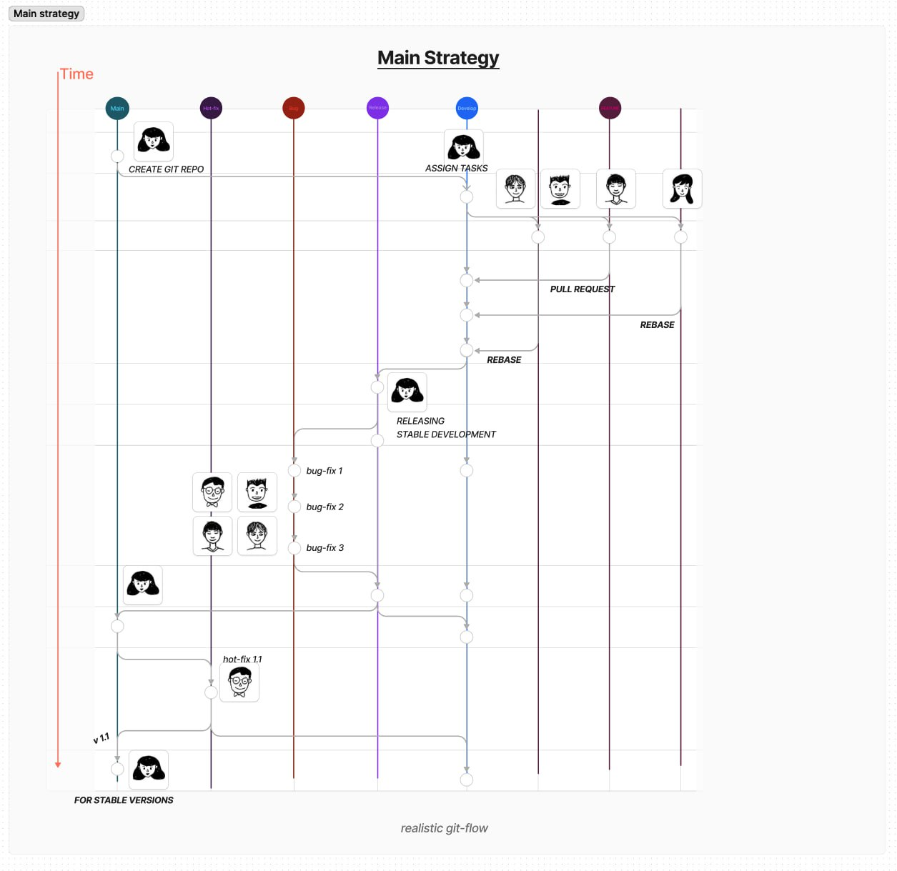

# Overview

## Project Information

Project name : Team_Mission_ANUA<br/>
Project owner : LUCK <br/>
Project server : GitLab

## Project Description
**Welcome to our project**.
We are LUCK, our chosen website to clone is [anua.us](https://anua.us/). The overall project that we have cloned consists of thirteen pages. We have implemented the knowledge and skills we had acquired throughout the recomended course to the project. The following [RESPONSIBILITIES](https://www.figma.com/design/8srOgTcoztu5YeYrClsNtP/Auau-Cloning-Project?node-id=174-1899&t=9WbHAEhkckqSs4N6-1) illustrates the contributions that each team member makes.

- [anua.us](https://anua.us/) is a cosmetic ecommerce website which inludes each of the product details and their conpany's information.
- It is really convenient to seek for information or ingredients from each of Anua's product with attractive User Interface. On top of that, we can easily find the product details as well as the review from the product.

## How to Install and Run the Project

- To get the source code, you can use the git clone with the attached link below:
```shell
git clone https://git.clp.kr/anbschool/2nd/luck/team-projects/team_mission_anua.git
```
- Since our first project contains of small number of pages and team members are beginers, we plainly used programming languages such as HTML, CSS/SCSS and JavaScript without any frameworks except bootstrap. Therefore, to run the project you can just simply open it with the live-server or run it on visual studio code.


## Contributors

- The Project was done very well, thanks to our dedicated developers and designers below:
+ Ek Raksmeysomaly
+ Hong Sovannary
+ Yun Chankrisna
+ Rith Sokhaneadh
+ Prak Sambath
+ Hun Vadna Samedy
+ Sovan Panha
+ Chea Hakkerby
+ Sochit Sovattana

## Team Collaboration 

- We have implemented the code base on our gitflow strategy below:

- Our Git Convention Guide:
[Git Convention](https://docs.google.com/spreadsheets/d/1vyJJ5cIChH2KyNmeGg6SQQCYFPqE8xbpQu5S8hb2e20/edit?usp=sharing)

## Project's Figma

- You can check out the prototype of website with given links below:

[UI Protoype and UI Screen](https://www.figma.com/design/8srOgTcoztu5YeYrClsNtP/Auau-Cloning-Project?node-id=0-1&t=9WbHAEhkckqSs4N6-1)

[Flow Planning](https://www.figma.com/design/8srOgTcoztu5YeYrClsNtP/Auau-Cloning-Project?node-id=86-77&t=9WbHAEhkckqSs4N6-1)

[Production Prototype](https://www.figma.com/proto/8srOgTcoztu5YeYrClsNtP/Auau-Cloning-Project?node-id=83-3866&t=PUQ7uyDHw0wEeyss-1&scaling=scale-down&page-id=0%3A1&starting-point-node-id=83%3A3866&show-proto-sidebar=1)

## Convention guide

Here is the convention guide to our code structure and rules. To visit convention guide page click this [link](https://docs.google.com/document/d/1yoXZc133rxNs7SNdLMXFn6rJ3D3C5c2rFZS0TgNHFz0/edit?usp=sharing)


				